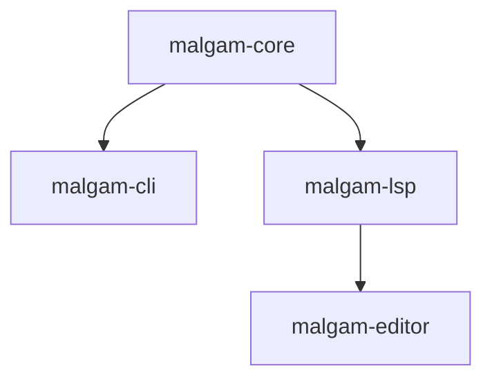

# Malgam

High-performance programmable markup compiler WIP

## Architecture

`malgam-core` contains core utilities used to parse Malgam markup and object notation. It

```mermaid
flowchart
    core[malgam-core]
   core --> cli[malgam-cli]
   core --> lsp[malgam-lsp]
   lsp --> editor[malgam-editor]
```
