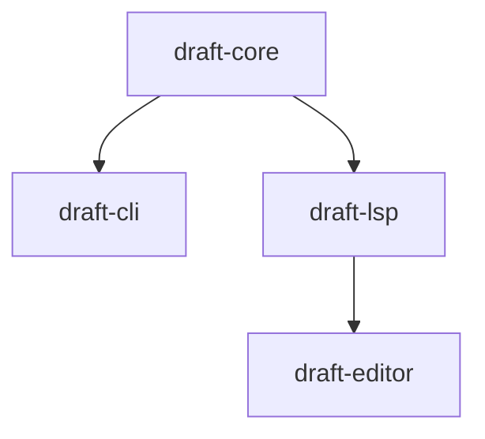

# Draft

High-performance programmable markup compiler WIP

## Architecture

`draft-core` contains core utilities used to parse Draft markup and object notation. It



need for `rustfmt.toml`:
```bash
rustup toolchain install nightly
```